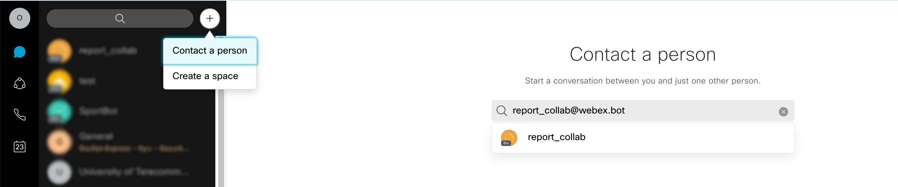

# Secret Santa Webex
Webex bot for Secret Santa

Secret Santa is a Christmas tradition of anonymously exchanging gifts with a group of people. The Secret Santa Webex bot can help to make everything easy and convenient.

- [x] collect/count the user's that want to partisipate in Secret Santa
- [x] Randomly mixes all participants, and
- [x] aggregate and submit daily reports with information about bookings and available (empty) seats to Space(Room) (or user list)

### Requirements
- [Python](https://www.python.org/downloads/)
- [Docker](https://www.docker.com/get-started)

### How works with adaptive cards

#### Creating a webhooks 

For reading data from users after Adaptive Card interaction and sending messages we create two webhooks:

```
def createWebhook(bearer, webhookUrl):
    hook = True
    botWebhooks = send_webex_get("https://webexapis.com/v1/webhooks")["items"]
    for webhook in botWebhooks:
        if webhook["targetUrl"] == webhookUrl:
            hook = False
    if hook:
        dataWebhook = {
        "name": "Messages collab bot Webhook",
        "resource": "messages",
        "event": "created",
        "targetUrl": webhookUrl
        }
        dataWebhookCard = {
            "name": "Card Report collab bot Webhook",
            "targetUrl": webhookUrl,
            "resource": "attachmentActions",
            "event": "created"
        }
        send_webex_post("https://api.ciscospark.com/v1/webhooks/", dataWebhook)
        send_webex_post("https://webexapis.com/v1/webhooks/", dataWebhookCard)
    print("Webhook status: done")
```

#### Creating and sending an Adaptive card 

For send adaptive card you need to use POST method

Sample of Python function

```
def postCard(personEmail):
    # open and read data from the file as part of the body for request
    with open("cardText.txt", "r", encoding="utf-8") as f:
        data = f.read().replace('USER_EMAIL', personEmail)
    # Add encoding, if you use non-Latin characters
    data = data.encode("utf-8")
    request = requests.post('https://webexapis.com/v1/messages', data=data, headers=headers).json()
```


<details><summary>Sample of body (click me)</summary>
<p>
{
    "toPersonEmail": "USER_EMAIL",
    "markdown": "Santa",
    "attachments": [
        {
            "contentType": "application/vnd.microsoft.card.adaptive",
            "content": {
                "$schema": "http://adaptivecards.io/schemas/adaptive-card.json",
                "type": "AdaptiveCard",
                "version": "1.0",
                "body": [
                    {
                        "type": "Image",
                        "altText": "",
                        "url": "https://i.ibb.co/dmD0xNF/santa-ua.png"
                    },
                    {
                        "type": "TextBlock",
                        "text": "Hi! \n Secret Santa is a Christmas tradition of anonymously exchanging gifts with a group of people. And to make everything easy and convenient this year, I, the Secret Santa bot, will help make it happen! If you want to take part, please write to me how you will receive the gift: \n -  Through the post office (then specify the branch number, recipient's name, and phone number, e.t.c.) \n - or just write in the 'office' (then your gift will be waiting at the reception) \n \n And some more rules: \n 1) By 12.12 (10:00) all participants will receive an address to send a gift. \n 2) It is desirable to choose something in the budget up to $10. \n 3) Sending gifts must be done by 16-20.12. \n \n Happy New Year everyone!",
                        "wrap": true
                    },
                    {
                        "type": "Input.Text",
                        "id": "address",
                        "placeholder": "through the office reception, or postal address"
                    }
                ],
                "actions": [
                    {
                        "type": "Action.Submit",
                        "title": "Send the address and take part"
                    }
                ]
            }
        }
    ]
}
</p>
</details>

#### How get data after users interacting with Adaptive card 

You can read users interaction like wich button pushed or data entered. 

After user interact with element like button with next parameters
```
                    {
                        "type": "ActionSet",
                        "actions": [
                        {
                        "type": "Action.Submit",
                        "title": "Send data",
                        "data": {
                            "button": "send_inform"
                            }
                        }
                        ],
                    "horizontalAlignment": "Left",
                    "spacing": "None"
                    }
```

After pushing buton with type `Action.Submit` on your webhook server you recive `POST` request like below :

```
{
   "actorId":"Y2lzY29z...............L1BFT1BMRS85NjVlM...............TYtOTVlMi1hMDljYmFl...........",
   "appId":"Y2lzY29zcG......................xJQ0FUSU9OL0MzMmM4MD................ZjE2ZjIyOGRmNjI4YmJjYTQ5YmE1MmZlY2JiMmM3ZDUxNWNiNG.............",
   "created":"2020-08-18T14:59:23.500Z",
   "createdBy":"Y2lzY2..................T1BMRS8wOGQ0O..................DItOGIyOC0zNjMwYjA............",
   "data":{
      "created":"2020-08-18T15:25:33.316Z",
      "id":"Y2lzY29zcGF................VEFDSE1FTlRfQU...................QwLWUxNjctMTFlYS1iNTI5LWY1YWU................",
      "messageId":"Y2lzY29..............BR0UvZjQ0ZWYzM..............WFhY2EtNGZkMmFi..............",
      "personId":"Y2lzY.............zL1BFT1BMRS85NjVlMT................YtOTVlMi1hMDljYm..............",
      "roomId":"Y2lzY.............00vNDU1NDIxN2Yt...............Y2Q0NGUzYT...........",
      "type":"submit"
   },
   "event":"created",
   "id":"Y2lz...........PT0svMjNiNTc3MzQt...............DQtZWMyOWM4M.............",
   "name":"Card Report collab bot Webhook",
   "orgId":"Y2l............9SR0FOSVpBVElP.............LTQxN2YtOTk3NC1hZDcyY2F..........",
   "ownedBy":"creator",
   "resource":"attachmentActions",
   "status":"active",
   "targetUrl": "https://domain_for_webhook.com"
}  
```

For reading data, you need to filtered webhook as in the sample below, and get JSON data by webhook ID:

```
if webhook['resource'] == 'attachmentActions':
            result = send_webex_get('https://webexapis.com/v1/attachment/actions/{}'.format(webhook['data']['id']))
```            

In response, you can find key `"inputs"` where you can parse all inputs from the user  
```
{
"id": '"Y2lzY29zcGFyazovL3VzL0FUVEFDSE1FTlRfQUNUSU9OLzUyN2YxODYwLTVjYzAtMTFlYy05N2RmLTBiNTg4NjUzYjFkYg", "type": "submit", 
"messageId": "Y2lzY29zcGFyazovL3VzL01FU1NBR0UvMTkwYWQ3ZTAtNWNjMC0xMWVjLWFlODItMDEwYzFjOTdlMDZm", 
"inputs": {"address": "INPUT ADDRESS"}, 
"personId": "Y2lzY29zcGFyazovL3VzL1BFT1BMRS85NjVlMTM0MS1jMDQwLTQ4MTYtOTVlMi1hMDljYmFlNTFhYzc", 
"roomId": "Y2lzY29zcGFyazovL3VzL1JPT00vN2U3MjU3NTAtNTk5My0xMWVjLTljMzMtNDlkOTM5NWE5ZTg4", 
"created": "2021-12-14T09:29:22.918Z"
}
```
And here is the sample of response if you sent this card


Below you can see some example
You can test to send your using this project (paste your Adaptive Card Payload in this file [cardText.txt](cardText.txt)) or using this Postman collection

Useful links:
- [Adaptive buttons and cards designer](https://developer.webex.com/buttons-and-cards-designer)
- [Use Adaptive cards in Webex Teams](https://developer.webex.com/docs/api/guides/cards)
- [Docs and Schema Explorer](https://docs.microsoft.com/en-us/adaptive-cards/)

After sending you can get details using this request

And parse date from user

### Installation

**1. Clone and open project**

```
git clone https://github.com/oborys/booking_workplace_webex_bot
cd booking_workplace_webex_bot
```
**2. Open files [cred](cred), [app/views.py](app/views.py) and [Dockerfile](Dockerfile)**

**3. Create a Webex bot and Webhook**

Create Webex Bot:
- [Sign-up](https://www.webex.com/pricing/free-trial.html) or [Sign-in](https://teams.webex.com/signin) in Webex Teams
- Go to [https://developer.webex.com/](https://developer.webex.com/), then click [My Apps](https://developer.webex.com/my-apps) and click Create a Bot

Copy Bot's Access Token


**Paste it into the file [cred](cred) variable `WEBEX_TEAMS_TOKEN` and past bot email in `WEBEX_BOT_EMAIL` variable**

For sent information to your server/localhost, create [Webhook](https://developer.cisco.com/learning/tracks/devnet-express-cloud-collab-it-pro/creating-spark-bots-itp/collab-spark-botl-itp/step/4)

For testing on localhost, you can use [ngrok](https://ngrok.com/download)
After installing ngrok open **new terminal window** and run the command
For fix [Webhook delivery issues with ngrok](https://developer.webex.com/blog/webhook-delivery-issues-with-ngrok)
```
ngrok http 56733
```


#### Do not close this terminal window, since the app needs it to redirect webhooks to your localhost.

**Сopy and paste url in file [app/views.py](app/views.py) variable `webhookUrl`**


Open file [app/views.py](app/views.py) and in this variable `adminEmailList` add email list of users/admins who can use the command `/inform` that can send information to participants

**After completing all the above points, we can build a container**

Run docker container on port 56733
```
bash start.sh
```

Check app availability on your server http://ip-address:56733 or http://localhost:56733

For checking docker container you can use next CLI command

```
docker ps
```


Running the next command you can see information about container logs, also monitor all output information from the Python app. And command like print, logging.debug, logging.info, logging.warning.   

```
docker logs [CONTAINER ID]
```
If you edit code files or requirements.txt, run next commands to apply changes
```
sudo docker stop sport_report_collab.docker && sudo docker start sport_report_collab.docker
```

Remove the docker container. In case if you got some critical errors, or edit your `Dockerfile` or `uwsgi.ini`
```
docker rm -f [CONTAINER ID]
```
### Interaction with bot

Find a bot to interact with

Enter the email of bot that you create




Interaction with bot


### How it's works

The main part of the code is stored in `app/views.py`

Users can send message to the bot, bot reply with adaptive card:


After users responce we store all replys in allParticipantAddress.txt
this sentence stored in file:

#### Available commands

**/list**
In response to the message `/list`, the bot sends a list of Secret Santa participants.

**/runsanta**
The bot shuffled participants and created a Cyclic permutation that each of the participants had someone to give a gift to and a gift from another participant. Bot sends a notification to each participant with information for whom and how to give a gift. All Chain are stored in `allParticipantChain.txt`
> this command is available only for users wich emails is in variable adminEmailList (line 44, [this file](app/views.py))


**Other Useful links**

- [How To Build and Deploy a Flask Application Using Docker on Ubuntu 18.04](https://www.digitalocean.com/community/tutorials/how-to-build-and-deploy-a-flask-application-using-docker-on-ubuntu-18-04)
- [Cyclic permutation](https://en.wikipedia.org/wiki/Cyclic_permutation)
